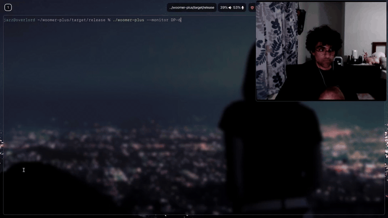

# Woomer+


A Blazing fast Zoomer application for Hyprland, heavily inspired by [Woomer](https://github.com/coffeeispower/woomer) and [Boomer](https://github.com/tsoding/boomer)
## Dependencies

### Arch Linux

```console
$ sudo pacman -S wlr-screencopy
```

## Quick Start

```console
$ cargo build --release
$ ./zoomer --help
$ ./zoomer
```

## Controls

| Control                                   | Description                                                   |
|-------------------------------------------|---------------------------------------------------------------|
| <kbd>q</kbd> or <kbd>ESC</kbd>            | Quit the application                                         |
| <kbd>Ctrl</kbd>                           | Flashlight Effect                  |
| Drag with left mouse button               | Move the image around                                        |
| Scroll wheel| Zoom in/out                                                  |

## Coming Soon

- Config File
- AUR Package for easy install
- Changing size of flashlight
- Drawing on the image with rightclick?
